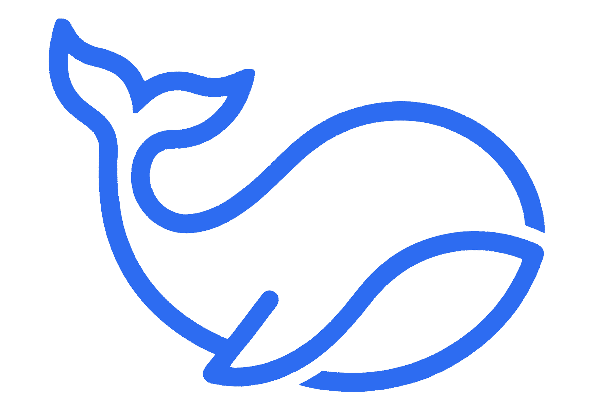

  
   
   
  

        
  

 

<!-- -  More about me and my blog on: https://ntphiep.github.io/

- ⚡ I’m on my way to **Data Engineering / DevOps Engineering**
  
- 🌱 I regularly learn about **Data** and **DevOps** 
  
- 🔭 I’m looking to collaborate on **OpenSource Data Projects**

 -->

<!-- <h1 align="center">Hi there, my name is Hiep.</h1>
<h3 align="center">Just a man!</h3>

<h4 align="center">🚬</h4> -->  
<!--

Here are some ideas to get you started:

- 🔭 I’m currently working on ...
- 🌱 I’m currently learning ...
- 👯 I’m looking to collaborate on ...
- 🤔 I’m looking for help with ...
- 💬 Ask me about ...
- 📫 How to reach me: ...
- 😄 Pronouns: ...
- ⚡ Fun fact: ...

<h2> Skills  </h2>

  
    
  
  
  
<be>
-->

 
<be>
 

  

<!--

## GitHub Analytics ⚙️ &nbsp;

-->

